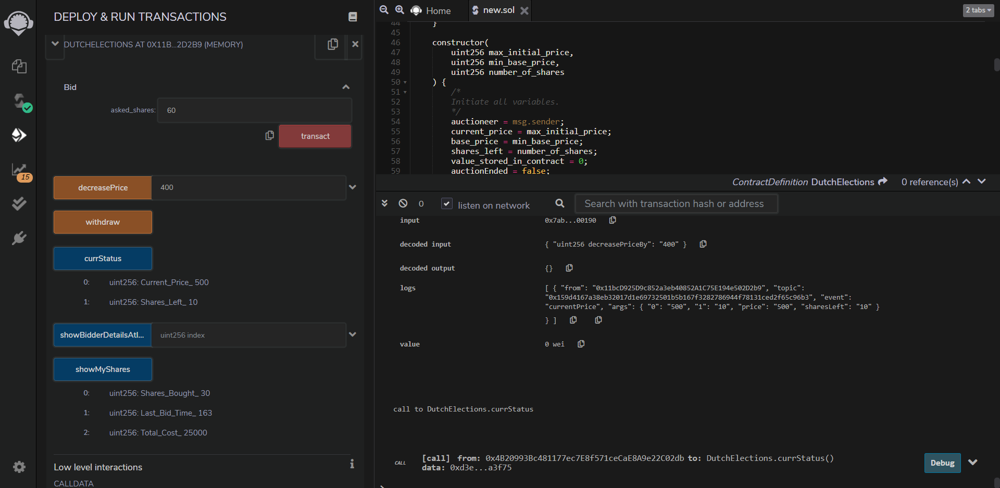

# Dutch Auction Mechanism

A dutch auction is a market structure, primarily based on the idea of _initial public offering_.  
The price of something offered is determined after taking in all bids to arrive at the highest price at which the total offering can be sold. In this type of auction, investors place a bid for the amount they are willing to buy in terms of `quantity` and `price`.

---

## Key Points

1. One of the main distinguishing features of this mechanism, is the price of item is kept quite high initially, and price is lowered until it gets a bid.  
   Therefore there is actually no competition between bidders during the auction itself.

2. The price with the highest number of bidders is selected as the offering price, so entire amount is sold at a single price. This price may not be the highest nor the lowest.

3. Such auction is quite popular for day-to-day used items or consumables.

---

## Thought Process

A Dutch Auction is based on the above key points.  
The Auctioneer, i.e. the holder of the auction provides the contract:

- Minimum Stock Price
- Maximum Price at Start of Auction
- Number of Shares to be distributed

The following functions are availabe for interaction:

---

### `bid(uint sharesAskedFor)`

Function used by any address to bid at a current price. Have to provide the number of shares asked for.  
This function is payable, so the address must provide some value while bidding.  
The extra money sent by him will be returned back instantly.  
If by any means this is disrupted, the user can call another `withdraw` function.

---

### `decreasePrice(uint decreasePriceBy)`

Function used only by the Auctioneer, to decrease the current price of a single share.  
This function will end the Auction if the current price is already the minimum stock price, and this function is called again.

---

### `showBidderWhoWonAtIndex(uint index)`

Function that returns the struct showing the details of winning bidders in order of their winning time.
This returns the following:

- Address of the bidder
- Shares bought
- Cost of total shares bought
- Last Timestamp of buying shares

---

### `showMyShares()`

Function that can be used by msg.sender to view his/her shares.

---

### `currStatus()`

Function returning the current status of the auction

- the number of shares availabe to be sold
- the current price per share.

---

More details about our approach can be seen [here](./approach.txt).  
[openAuction.sol](./openAuction.sol) was for our reference.

---

## Final Result

We deployed this contract and tested on [REMIX](https://remix.ethereum.org).

---

## Team

- [S. Pradeep](https://github.com/suresh-pradeep)
- [Piyush Beegala](https://github.com/franticalien)
- [B. Anshuman](https://github.com/ba-13)
