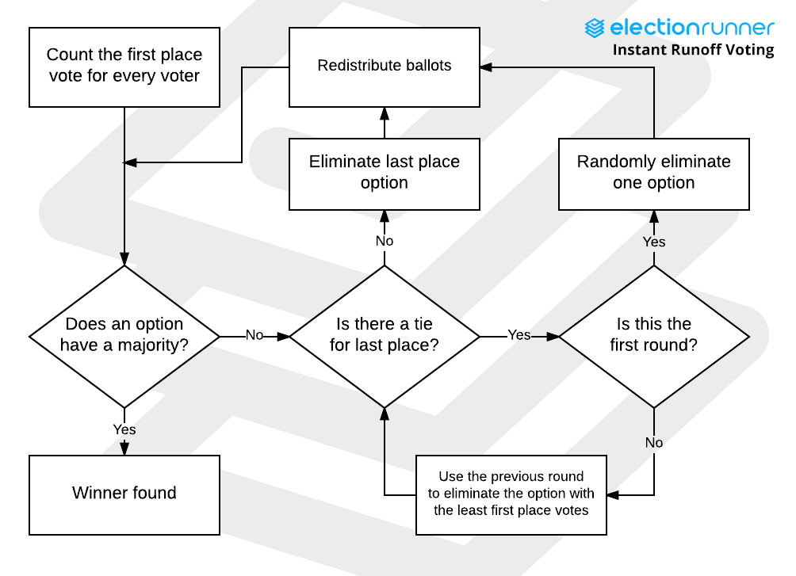
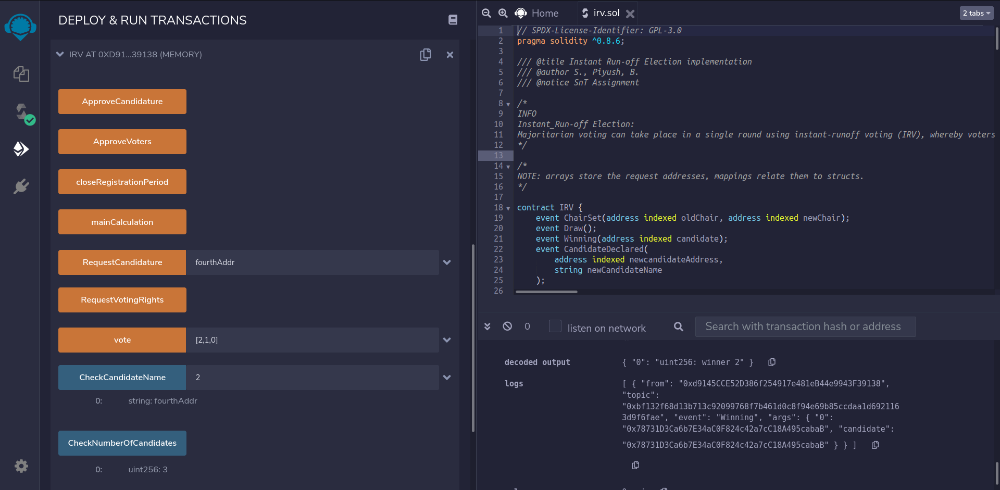

# Majoritarian Election - IRV

Alias - Alternate Voting (<mark>AV</mark>), Instant-Runoff Voting (<mark>IRV</mark>), Preferential Voting, Ranked-choice Voting.

---

This is a type of _ranked preferential voting-cum-counting method_ used in single-seat elections with more than 2 candidates.  
Voters pass their support to the candidates, on the basis of preferences, in simpler terms, they have to rank candidates on their ballot.

## Problems with IRV

AV/IRV is competent only with single-seat voting elections.  
If applied to legistative voting or similar, we come across a few problems:

- IRV is not meant for proportional representation

  - This implies it is still a winner-takes-all type of election implementation.
  - It leaves out political minority.

- IRV slightly reduces but does not eliminate most of the enormous numbers of wasted votes in plurality elections.

- It also does not produce multiparty legislatures that truly reflect the variety of political views in the electorate

- IRV eliminates none of the problems associated with redistricting, such as uncompetitive districts and partisan gerrymandering

## Implementing IRV as a contract - Flaws

Having explained its possible problems,
One of drawbacks of our election implementation, is when 2 candidates tie for the bottom place, the elimination.  
A valid Tiebreaker is to eliminate both the candidates, and transform their voters' ballots by deleting these candidates' mentions.

Another drawback is while filling in the candidate preference order, the voter can input multiple instances of the same candidate, which is not valid. We haven't implemented verification to check if all inputs are unique, and either this can be trusted upon the voter, or the interface with which the voter is interacting with this contract.

50% or above votes are counted as majority in this contract.

In case of a draw, the contract emits Draw log, but fails to return their addresses. One can still do so, by checking all candidates' votes individually.

## Implementing IRV - Thought process

An IRV election is based on fact that a single candidate wins the final, or there is a draw between 2. Voters are addresses, who first request for VoterRights to the Chairperson, who has initiated the contract.  
The Chairperson can accept all pending requests of votership, but as of this contract, there is no means to reject a particular address as a voter.  
A voter then can opt for being a candidate, by requesting for the same. Chairperson again, has the power to accept all pending requests, but not filter them out.  
A candidate has to provide its name as well.  
Then the Registration Period ends, which is decided by the Chairperson.  
During Voting Period, Voters have to submit an array with indexes as inputs, according to indices shown by requesting to view a particular candidate. The Voter has to provide ranking of all the candidates, else his vote is not accepted.  
All Candidates, by default, are voters, so they have to do the same.  
The Voting Period is ended by the Chairperson, and all interaction with the contract halts.  
The contract then returns the winning candidate to the Chairperson and emits his address, all according to the rules of instant run-off election mechanism, with certain drawbacks mentioned above.  
If there is indeed, a draw, the Chairperson has to re-initiate the contract, or can opt for changing the period back to 2, i.e. the Voting Period.

## Implementing IRV - Functions involved

- constructor()

period = 1 starts
registrationSession

- RequestVotingRights()
- ApproveVoters()
- RequestCandidature(string memory name)
- ApproveCandidature()
- closeRegistrationPeriod()

period = 2 starts
votingSession

- CheckNumberOfCandidates()
- CheckCandidateName(uint256 k)
- vote(uint256[] memory preferenceList)

countingSession
period = 3 starts

- mainCalculation()
- majorityOrEliminatedCandidate()
- eliminateCandidate(uint256 indexOfLosingCandidate)

## Approach Layout

Rest of approach and smaller details are explained in a-not-so-properly explained manner in [approach.txt](./approach.txt)

Test Election tried on [REMIX IDE](https://remix.ethereum.org/)

## Team

- [S. Pradeep](https://github.com/suresh-pradeep)
- [Piyush Beegala](https://github.com/franticalien)
- [B. Anshuman](https://github.com/ba-13)
